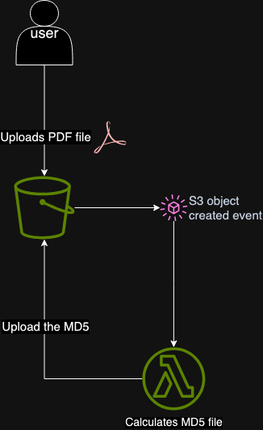

# Checksum Calculator

## Overview

Checksum Calculator module is a solution for calculating MD5 checksums of objects
uploaded to an AWS S3 bucket and stores it as a separate object in S3.

## Componentes

- **AWS S3 Bucket**: The primary storage for objects.
- **AWS Lambda Function**: Automatically calculates the MD5 checksum for each new object.

## Design

While testing 1000 PDF file upload the following design works seamlessly


If we would like to make it more durable and highly available we can introduce a pub-sub mechanism and event bus (AWS SQS and Event bridge)

TODO: insert diagram with SQS and Event Bridge here


## Prerequisites

- AWS Account with appropriate permissions.
- Terraform v1.9+ installed.

## Usage

To use this module, include it in your Terraform configuration:

```hcl
module "checksum_calculator" {
  source              = "./checksum_calculator"
  bucket_name         = "your-s3-bucket-name"
  region              = "your-aws-region"
  lambda_role_name    = "your-lambda-role-name"
}
```

1. Run the following Taskfile commands:
```taskfile
task apply
```

2. Upload a PDF file to the specified S3 bucket
```taskfile
task test
```

3. Verify that an MD5 checksum file is created


### Cleanup

To destroy the infrastructure and avoid incurring charges, run:
```taskfile
task destroy
```

<!-- BEGIN_TF_DOCS -->
## Requirements

| Name | Version |
|------|---------|
| <a name="requirement_terraform"></a> [terraform](#requirement\_terraform) | >= 1.9.0 |
| <a name="requirement_aws"></a> [aws](#requirement\_aws) | ~> 5.57.0 |
| <a name="requirement_random"></a> [random](#requirement\_random) | ~> 3.6.2 |

## Providers

| Name | Version |
|------|---------|
| <a name="provider_random"></a> [random](#provider\_random) | 3.6.2 |

## Modules

| Name | Source | Version |
|------|--------|---------|
| <a name="module_iam"></a> [iam](#module\_iam) | ./modules/iam | n/a |
| <a name="module_lambda"></a> [lambda](#module\_lambda) | ./modules/lambda | n/a |
| <a name="module_s3"></a> [s3](#module\_s3) | ./modules/s3 | n/a |

## Resources

| Name | Type |
|------|------|
| [random_string.bucket_suffix](https://registry.terraform.io/providers/hashicorp/random/latest/docs/resources/string) | resource |

## Inputs

| Name | Description | Type | Default | Required |
|------|-------------|------|---------|:--------:|
| <a name="input_bucket_name"></a> [bucket\_name](#input\_bucket\_name) | The name of the S3 bucket where objects will be uploaded | `string` | n/a | yes |
| <a name="input_lambda_role_name"></a> [lambda\_role\_name](#input\_lambda\_role\_name) | The name of the IAM role for the Lambda function | `string` | `"lambda-s3-md5-calculator-role"` | no |
| <a name="input_region"></a> [region](#input\_region) | The AWS region where resources will be deployed | `string` | n/a | yes |

## Outputs

| Name | Description |
|------|-------------|
| <a name="output_bucket_name"></a> [bucket\_name](#output\_bucket\_name) | The name of the S3 bucket where objects will be uploaded |
| <a name="output_lambda_function_name"></a> [lambda\_function\_name](#output\_lambda\_function\_name) | The name of the Lambda function |
<!-- END_TF_DOCS -->